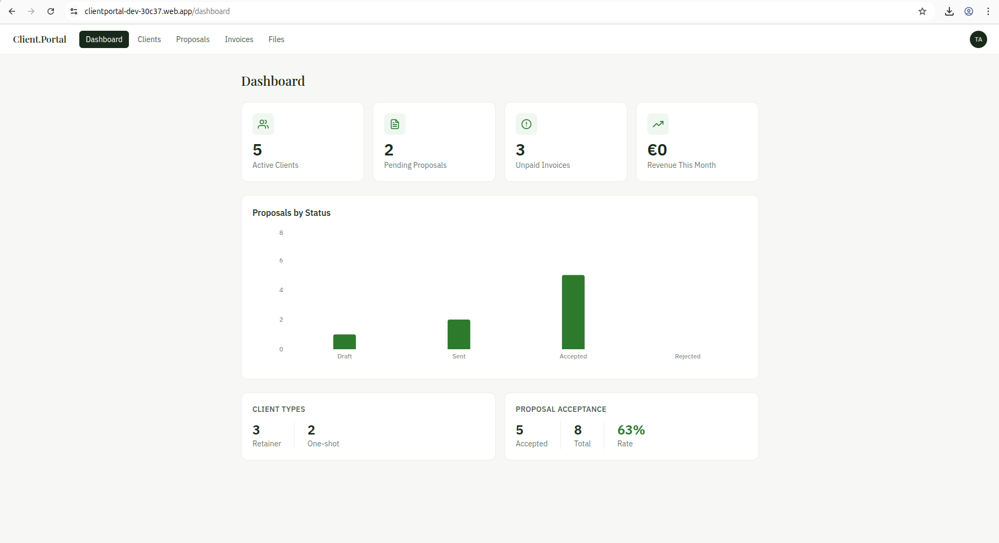
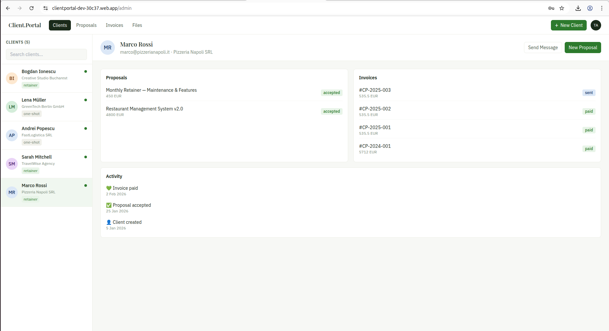
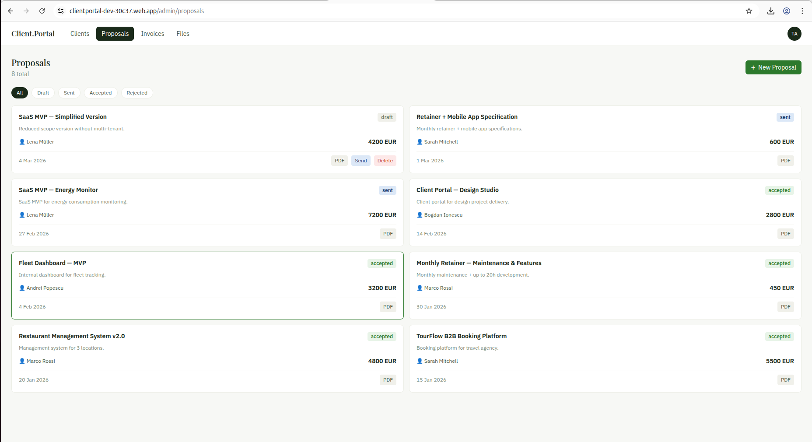
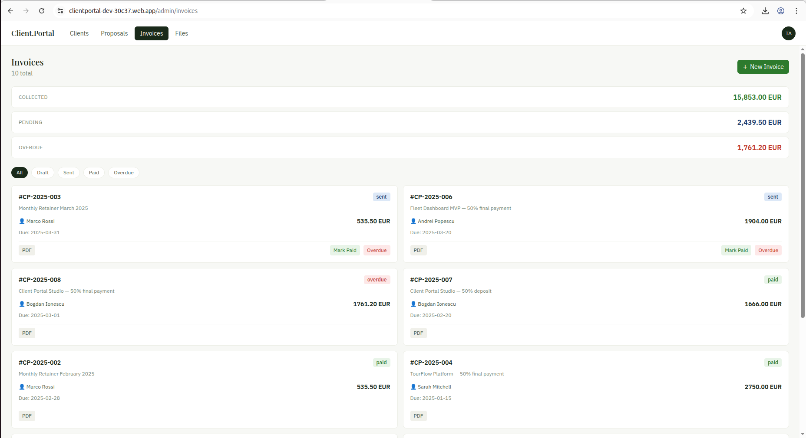
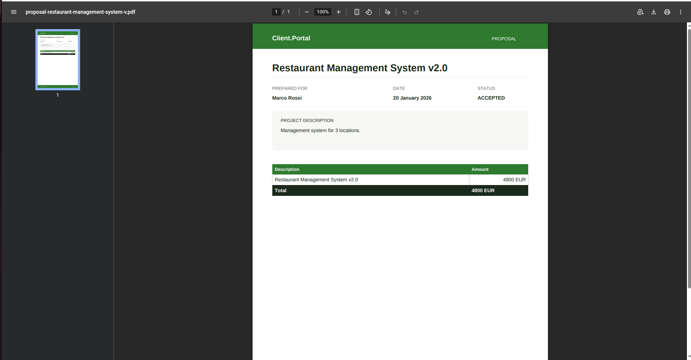
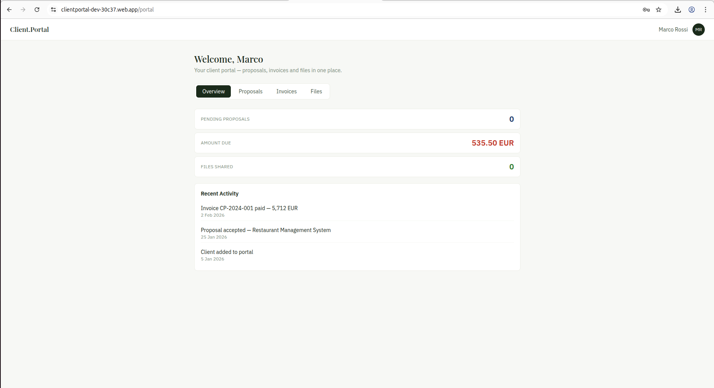
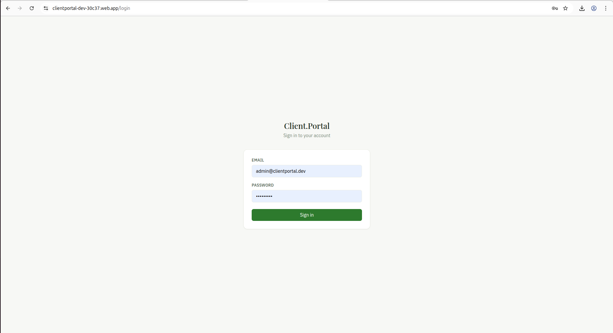
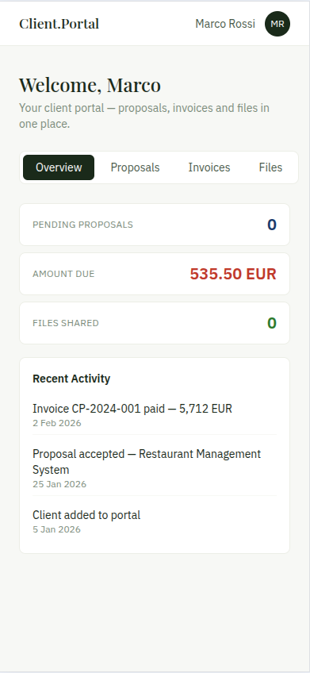

# ClientPortal

[](https://clientportal-dev-30c37.web.app)
[](https://clientportal-production-7d37.up.railway.app)
[](https://react.dev)
[](https://nodejs.org)
[](https://firebase.google.com)
[](https://tailwindcss.com)

ClientPortal is a full-stack freelancer client management platform built with React, Node.js, and Firebase. It enables freelancers to manage clients, send proposals, track invoices, and share files — all from a clean master-detail interface. Clients get their own login to view proposals, accept or reject them, download invoices, and track project files.

---

## 🔐 Demo Access

ClientPortal has two separate roles — try both to see the full experience:

| Role | URL | Email | Password |
|------|-----|-------|----------|
| **Admin** (freelancer view) | [clientportal-dev-30c37.web.app](https://clientportal-dev-30c37.web.app) | `demo.admin@clientportal.app` | `Demo1234!` |
| **Client** (Bogdan Ionescu) | [clientportal-dev-30c37.web.app](https://clientportal-dev-30c37.web.app) | `demo.client@clientportal.app` | `Demo1234!` |

The admin sees all clients, proposals, invoices and files. The client sees only their own data — filtered by role from the Firebase token.

---

## Screenshots

| | |
|---|---|
|  *Dashboard with KPI cards & analytics* |  *Master-detail client management* |
|  *Proposals with status workflow* |  *Invoice management & PDF export* |
|  *File sharing via Firebase Storage* |  *Client self-service portal* |
|  *Admin login page* |  *Fully responsive on mobile* |

---

## Features

- 🔐 **Multi-role authentication** — separate admin and client logins via Firebase Auth
- 👥 **Client management** — master-detail layout with search, retainer/one-shot tagging
- 📄 **Proposals** — create, send, and track proposals with status workflow (draft → sent → accepted/rejected)
- 🧾 **Invoices** — generate invoices with line items, tax, and PDF export (jsPDF)
- 📁 **File sharing** — upload files per client via Firebase Storage, clients download via signed URLs
- 📊 **Dashboard** — KPI cards (active clients, pending proposals, unpaid invoices, monthly revenue) + Recharts bar chart
- 📱 **Fully responsive** — mobile-first with master-detail drawer, bottom navigation, card layouts
- ⚡ **REST API** — Node.js + Express backend with Firebase Admin SDK, deployed on Railway

---

## Architecture

```
clientportal/
├── backend/                  # Node.js + Express REST API
│   ├── src/
│   │   ├── lib/
│   │   │   └── firebaseAdmin.js      # Firebase Admin SDK init
│   │   ├── middleware/
│   │   │   ├── auth.js               # Firebase ID token verification
│   │   │   └── adminOnly.js          # Admin role check
│   │   └── routes/
│   │       ├── clients.js            # CRUD clients
│   │       ├── proposals.js          # CRUD proposals + status
│   │       ├── invoices.js           # CRUD invoices
│   │       ├── files.js              # Upload/download via Storage
│   │       └── activity.js           # Activity log per client
│   └── scripts/
│       └── seed.js                   # Demo data seed script
│
└── frontend/                 # React + Vite SPA
    └── src/
        ├── components/
        │   ├── Topbar.jsx            # Nav pills + mobile bottom bar
        │   ├── MasterList.jsx        # 280px client list panel
        │   └── DetailPanel.jsx       # Client detail panel
        ├── hooks/
        │   └── useAuth.js            # Firebase Auth state + token
        ├── lib/
        │   ├── firebase.js           # Client SDK (Auth only)
        │   ├── api.js                # Axios + auto Bearer token
        │   ├── proposalPdf.js        # jsPDF proposal generator
        │   └── invoicePdf.js         # jsPDF invoice generator
        └── pages/
            ├── admin/
            │   ├── DashboardPage.jsx
            │   ├── ClientsPage.jsx
            │   ├── ProposalsPage.jsx
            │   ├── InvoicesPage.jsx
            │   └── FilesPage.jsx
            └── client/
                ├── LoginPage.jsx
                └── ClientDashboard.jsx
```

---

## Tech Stack

| Category | Technology |
|---|---|
| Frontend | React 18 + Vite |
| Styling | Tailwind CSS v3 |
| Backend | Node.js + Express |
| Auth | Firebase Authentication |
| Database | Firebase Firestore |
| File Storage | Firebase Storage |
| PDF Generation | jsPDF + jspdf-autotable |
| Charts | Recharts |
| Routing | React Router v6 |
| Frontend Hosting | Firebase Hosting |
| Backend Hosting | Railway |

---

## Getting Started

### Prerequisites

- Node.js 18+
- npm
- Firebase account (Auth + Firestore + Storage enabled)

### Backend Setup

```bash
# 1. Clone the repository
git clone https://github.com/tudorsorinoltean/clientportal.git
cd clientportal/backend

# 2. Install dependencies
npm install

# 3. Configure environment variables
cp .env.example .env
```

Edit `backend/.env`:

```env
PORT=3001
FIREBASE_SERVICE_ACCOUNT=<base64_encoded_service_account_json>
FRONTEND_URL=http://localhost:5173
```

To encode your service account key:
```bash
base64 -w 0 serviceAccountKey.json
```

```bash
# 4. Start the backend
npm run dev

# Optional: seed demo data
npm run seed
```

### Frontend Setup

```bash
cd clientportal/frontend

# 1. Install dependencies
npm install

# 2. Configure environment variables
cp .env.example .env
```

Edit `frontend/.env`:

```env
VITE_FIREBASE_API_KEY=your_api_key
VITE_FIREBASE_AUTH_DOMAIN=your_project.firebaseapp.com
VITE_FIREBASE_PROJECT_ID=your_project_id
VITE_FIREBASE_STORAGE_BUCKET=your_project.appspot.com
VITE_FIREBASE_MESSAGING_SENDER_ID=your_sender_id
VITE_FIREBASE_APP_ID=your_app_id
VITE_API_URL=http://localhost:3001/api
```

```bash
# 3. Start the frontend
npm run dev
```

---

## API Endpoints

| Method | Endpoint | Auth | Description |
|--------|----------|------|-------------|
| GET | `/api/clients` | Admin | List all clients |
| POST | `/api/clients` | Admin | Create client |
| PUT | `/api/clients/:id` | Admin | Update client |
| DELETE | `/api/clients/:id` | Admin | Delete client |
| GET | `/api/proposals?clientId=` | Admin/Client | List proposals |
| POST | `/api/proposals` | Admin | Create proposal |
| PUT | `/api/proposals/:id/status` | Admin/Client | Update status |
| GET | `/api/invoices?clientId=` | Admin/Client | List invoices |
| POST | `/api/invoices` | Admin | Create invoice |
| POST | `/api/files/upload` | Admin | Upload file to Storage |
| GET | `/api/files/:clientId` | Admin/Client | List files |
| GET | `/api/activity/:clientId` | Admin/Client | Activity log |

---

Built by Tudor Sorin Oltean — tudorsorinoltean@gmail.com
